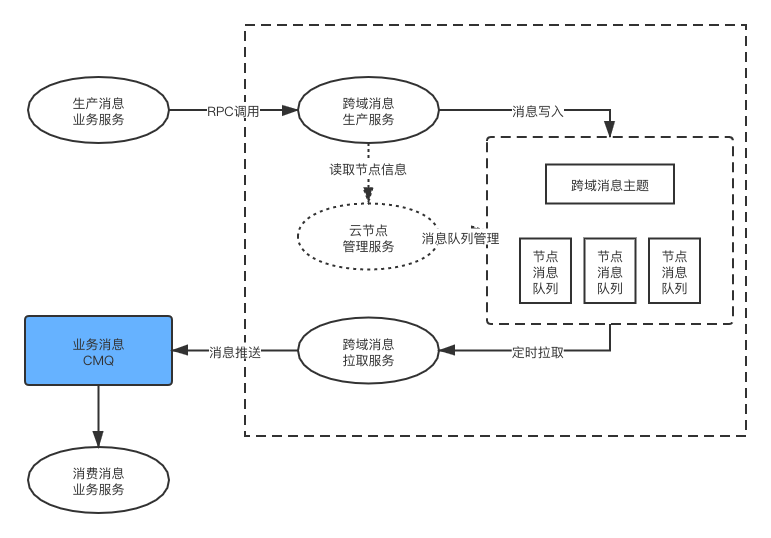

# CMQ的跨域转发服务

## 设计要点

1. 消息的基于cmq的同步demo 考虑延时问题
2. 消息的转发规则还需要明确标准或者规范

## 整体交互流程

 

## CMQ的特性整理

CMQ根据介绍文档有2种基本的模式 各有区别

### 队列(Queue)

1. 队列相当于一个高性能 高可用的分布式存储
2. 队列不支持按照Tag发送以及消费消息
3. [队列不会有严格的FIFO](https://cloud.tencent.com/document/product/406/8435)

### 主题(Topic)

1. 投递消息会有部分异常的情况无法处理

### [采纳]主题+队列的模式

1. 投递端通过主题来投递(区分不同的router_key)
2. 中间用队列来接收每个节点需要感知的消息
3. 每个节点的消息拉取服务定时的拉取本节点需要处理的消息

## 跨域消息设计格式

跨域消息应该是业务消息的信封

所以跨域消息可能的设计格式为

```
region: 递送的区域(指定的某个节点)
topic: 对应的主题
message: 实际业务的消息格式(用base64编码)
```

## 功能模块设计整理

### 1. 跨域消息生产服务

请求参数
```
region:
topic: 
message: 
```

返回参数
```
code:
message:
```

### 2. 跨域消息拉取服务

1. 定时拉取之前未消费的消息
队列中的消息不是严格按照时序的!
